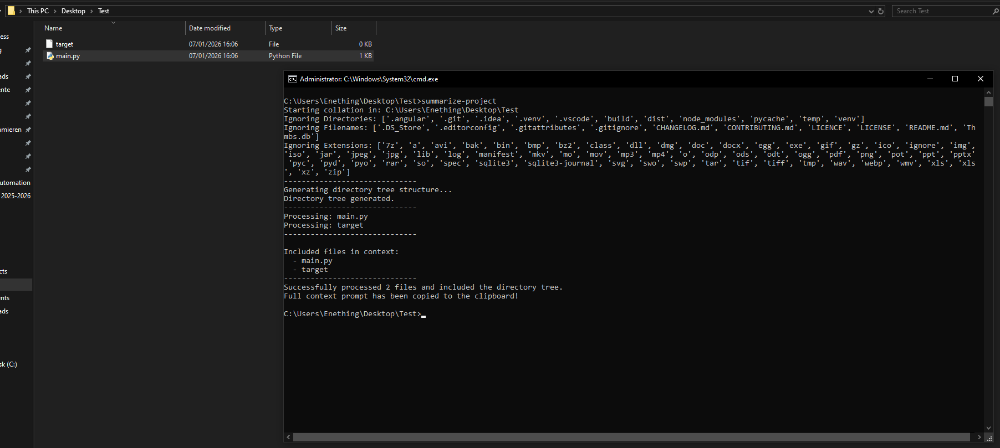
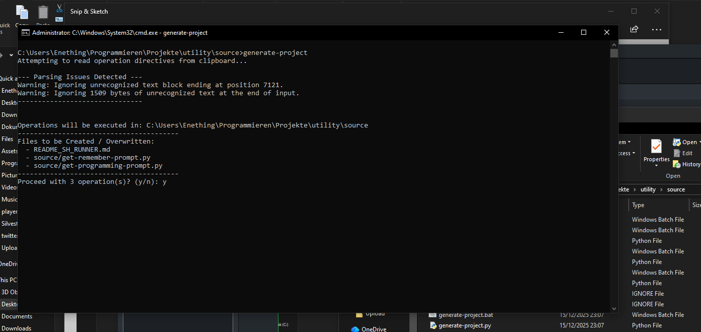

# AI-Native Development & Context Bridge CLI

## Overview

This repository houses a suite of high-performance Command Line Interface (CLI) utilities designed to bridge the gap between local Windows development environments and Large Language Models (LLMs).

In the era of AI-assisted engineering, the bottleneck is no longer code syntax, but **context velocity**—the speed at which a developer can serialize a codebase into an LLM and deserialize the generated response back into the filesystem. This toolkit eliminates that friction, turning the Windows command prompt into a powerful, Linux-adjacent environment optimized for rapid iteration.

## Technical Architecture

The framework operates on a "Context-Action" loop, enabling developers to treat their IDE as a state machine manipulated by high-fidelity AI prompts.

### 1. Context Serialization & Ingestion

The core of the framework is the **Context Ingestion Engine**. Instead of manually copy-pasting file contents, the `analyze-project` and `copy-files` modules provide a surgical interface for extracting codebase state.

* **Intelligent Token Optimization**: The engine parses `.gitignore` rules and employs heuristic filtering (ignoring binaries, locks, and logs) to generate a dense, token-efficient representation of the project structure and content.
* **Tree & Content Collation**: `analyze-project` generates a visual directory tree followed by XML-wrapped file contents. This format is specifically engineered to maximize an LLM's understanding of project hierarchy and file relationships.
* **Clipboard Integration**: All outputs are piped directly to the system clipboard via `pyperclip`, ready for immediate injection into an LLM context window.

### 2. Deterministic Code Generation (The Generator)

The `generate-project` module acts as the "write" head of the system. It parses structured XML responses from LLMs to execute file operations with surgical precision.

* **Atomic Operations**: Supports `create`, `update`, `delete`, and `rename` operations.
* **Safety Protocols**: Includes path sanitization to prevent directory traversal attacks and confirms operations before execution, ensuring the AI cannot accidentally destroy data outside the project scope.
* **XML Parsing**: robustly handles `<![CDATA[...]]>` blocks, allowing the generation of code containing special characters without parsing errors.

### 3. Windows Environment Homogenization

To further accelerate development on Windows, this suite includes a compatibility layer that brings essential Linux/Unix ergonomics to `cmd.exe`.

* **`ls` (Colorized Listing)**: A Python-based reimplementation of the Unix `ls` command. It features full color support based on file types (directories, executables, source files) and intelligent grid formatting, replacing the verbose Windows `dir`.
* **`.sh` Script Runner**: A lightweight interpreter that allows `.sh` shell scripts to execute natively on Windows. It parses and runs common bash commands (`export`, `cd`, `uvicorn`, etc.) without requiring WSL or Git Bash, enabling cross-platform script compatibility.
* **`cwd` (Path Normalization)**: Instantly retrieves the current working directory formatted as a Linux-style path (forward slashes), ready for use in configuration files or prompts.

## Command Reference

| Command | Description |
| --- | --- |
| `analyze-project` | Scans the directory, builds a tree, and copies relevant file contents to clipboard for AI analysis. |
| `generate-project` | Reads XML-formatted file operations from the clipboard and applies them to the filesystem. |
| `ls` | Lists directory contents with Unix-style color coding and grid layout. |
| `cwd` | Copies the current directory path to clipboard using forward slashes (`/`). |
| `admin` | Spawns a new command prompt instance with Administrator privileges in the current directory. |
| `sh <script.sh>` | Executes a shell script using the internal Python-based interpreter. |

## Usage

1. Add the `source` directory to your Windows System `PATH` environment variable.
2. Open any command prompt (`cmd` or PowerShell).
3. Execute commands directly (e.g., type `ls` to list files).

## Disclaimer

This toolkit is provided for productivity enhancement and educational purposes. While the `generate-project` script includes safety checks, always review AI-generated file operations before confirming execution. The author accepts no liability for data loss resulting from automated file manipulation.
