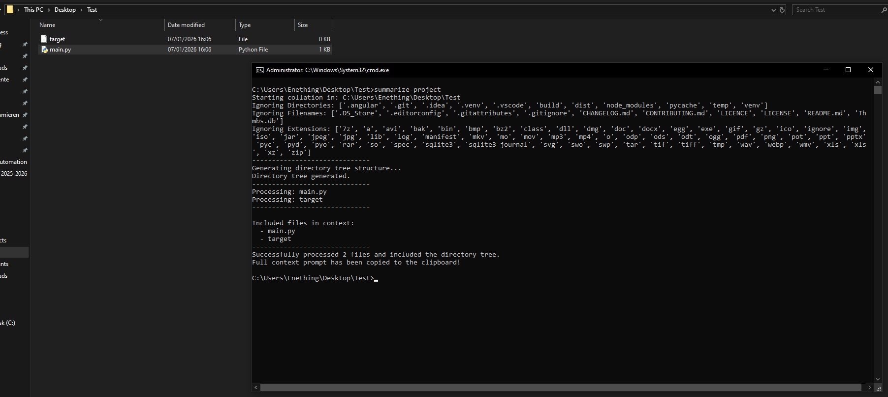

# utility — a small cross-platform CLI toolkit



A suite of command-line utilities for everyday development: bridging a codebase
into an LLM and back, managing local ports, reconnecting to SSH servers, and a
few Unix ergonomics for Windows. Written in Python so the same tools can run on
Windows, macOS, and Linux.

## Install

1. Add the `source/` directory to your `PATH`.
2. Install the one third-party dependency: `pip install pyperclip`.
3. Run any command by name (e.g. `ls`, `ports`, `check-port 5000`).

On Windows each tool has a `.bat` launcher; on macOS/Linux run the `.py`
directly or add small shell aliases.

## Commands

### Ports

| Command | Description |
| --- | --- |
| `ports` | List every listening TCP port and the process that owns it. |
| `check-port <PORT>` | Show what is listening on a port (read-only). |
| `stop-port <PORT>` | Kill whatever owns a port and report what was killed. `--dry-run` to preview. |

Port lookups use PowerShell (`Get-NetTCPConnection`) on Windows and `ss`/`lsof`
on Unix — invoked internally, so the tools work the same from `cmd`,
PowerShell, or a Unix terminal.

### SSH sessions

| Command | Description |
| --- | --- |
| `connect-server user@host [-p PORT] [-i KEY] [--label NAME]` | Connect via the system `ssh` client and remember the session. |
| `connect-server` | Pick a previously used server from a most-recent-first list. |
| `connect-server --list` | List saved servers. |
| `connect-server --remove <n>` | Forget the server at position `<n>`. |

Only connection details are stored (in `~/.config/utilkit/servers.json`) —
**never passwords**. Authentication is left entirely to `ssh` (keys, agent, or
its own prompt).

### LLM context bridge

| Command | Description |
| --- | --- |
| `analyze-project` | Collate the project (tree + files) with a read-and-answer prompt → clipboard. |
| `summarize-project` | Same collation with a make-the-change prompt, paired with `generate-project`. |
| `copy-files` | Copy just the XML-wrapped file contents (no prompt, no tree). |
| `project-structure` | Print and copy the directory tree. |
| `generate-project` | Apply `<file>`/`<delete>`/`<rename>` blocks from the clipboard, with a confirm step and path-safety checks. |

Common flags: `--only py` / `--only [py,js]` to include only some extensions,
`--ignore json` to add extra ignores, `--no-tree` to skip the tree.

| Command | Description |
| --- | --- |
| `get-programming-prompt` | Copy the standard engineer + file-format prompt. |
| `get-format-prompt` | Copy a "re-emit your last reply in the file format" prompt. |
| `get-remember-prompt` | Copy a short "keep using the file format" reminder. |

### Unix ergonomics

| Command | Description |
| --- | --- |
| `ls [path]` | Colorized, grid-formatted directory listing. |
| `cwd` | Print the current directory with forward slashes and copy it. |
| `extract <archive>` | Unpack `.zip`/`.tar.*`/`.gz` (and `.7z`/`.rar` via helpers) into `./<name>/`, with zip-slip protection. |
| `sh <script.sh>` | Run a simple shell script with a lightweight built-in interpreter. |
| `admin` | Open an elevated prompt in the current directory (Windows). |

## Architecture

Shared logic lives in `source/utilkit/` so the tools don't duplicate it:

- `config.py` — the single source of truth for ignore rules; extendable via
  `~/.config/utilkit/config.toml`.
- `walk.py` — project walking, tree rendering, binary detection.
- `collate.py` / `prompts.py` — XML collation and the embedded prompts.
- `ports.py` / `platform_ps.py` — port lookup and process control per platform.
- `sessions.py` — the SSH session store.
- `fileops.py` — parsing/applying file-operation blocks.
- `ui.py` — shared colors, tables, and headers (with ASCII fallback on legacy
  consoles).

## Tests

```
python tests/test_utilkit.py
```

## Configuration

Drop a `~/.config/utilkit/config.toml` to extend the ignore lists without
editing source:

```toml
ignore_directories = ["my_cache"]
ignore_extensions = ["bak2"]
ignore_filenames = ["NOTES.txt"]
```

## Disclaimer

`generate-project` and `stop-port` change your filesystem / kill processes.
`generate-project` confirms before writing and rejects unsafe paths; `stop-port`
acts immediately (use `--dry-run` or `check-port` first if unsure).
